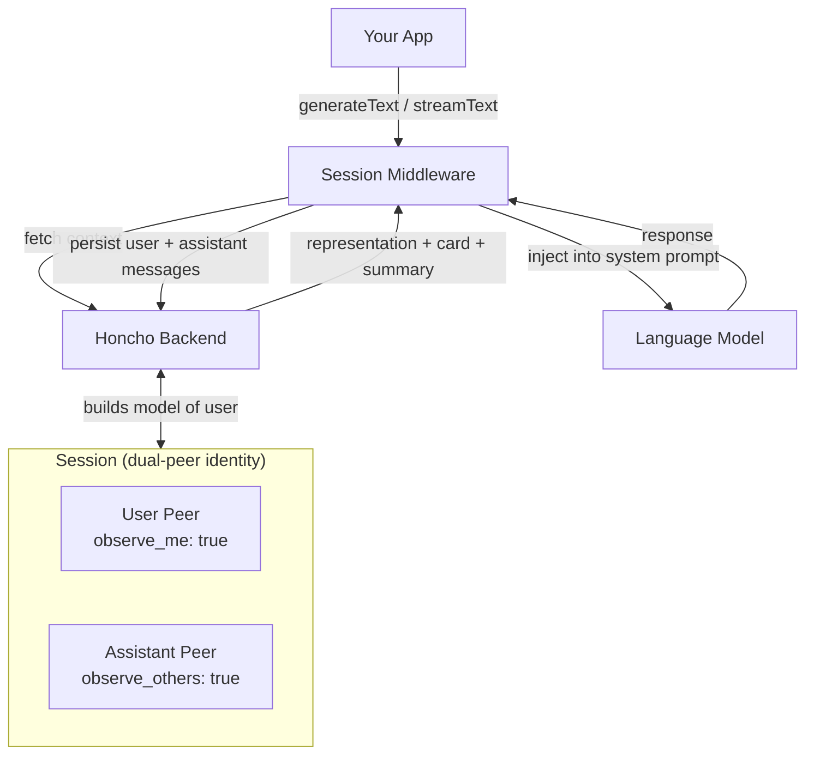

# @honcho/ai-sdk

Persistent memory and user modeling for the [Vercel AI SDK](https://sdk.vercel.ai).

`@honcho/ai-sdk` wraps any AI SDK model with [Honcho](https://honcho.dev) — giving it a continuously-updated understanding of who it's talking to, automatically injected into each generation and persisted across sessions.

## Architecture



Each session tracks two peers: the **user** (whose messages are observed and modeled) and the **assistant** (whose perspective shapes what context gets retrieved). Honcho continuously updates its representation of the user as the conversation evolves.

## Install

```bash
npm install @honcho/ai-sdk
```

Requires `ai@^6` and Node.js `>=18`.

## Quick Start

```ts
import { createHoncho } from "@honcho/ai-sdk";
import { wrapLanguageModel, generateText } from "ai";
import { anthropic } from "@ai-sdk/anthropic";

const honcho = createHoncho({
  workspaceId: process.env.HONCHO_WORKSPACE_ID!,
  // apiKey defaults to HONCHO_API_KEY env var
});

// Create a session handle — no API calls yet
const session = honcho.session("session-123", {
  user: "user-abc",
  assistant: "my-assistant",
});

// Wrap your model — middleware initializes lazily on first use
const model = wrapLanguageModel({
  model: anthropic("claude-sonnet-4-20250514"),
  middleware: session.middleware(),
});

const { text } = await generateText({
  model,
  tools: session.tools(),
  prompt: "What have you learned about me so far?",
});
```

On every call the middleware will:
1. Fetch the current representation, peer card, and session summary for the user
2. Inject that context into the system prompt
3. Persist the user and assistant messages back to Honcho after generation

## How It Works

### Dual-Peer Identity

Every session requires two named peers — the human user and the AI assistant. This matters because Honcho attributes messages differently depending on who sent them:

- **User peer** (`observe_me: true`) — Honcho builds a representation of this peer from their own messages
- **Assistant peer** (`observe_others: true`) — Honcho builds its view of the user from the assistant's perspective

This dual-peer design allows Honcho to develop a genuine theory-of-mind model of the user rather than a simple message log.

```ts
const session = honcho.session("session-id", {
  user: "user-abc",       // observed, modeled
  assistant: "asst-xyz",  // the observer
});
```

### What Gets Injected

The middleware injects a structured block into the system prompt containing:

- **Representation** — a long-form, continuously-updated understanding of the user
- **Peer card** — structured facts extracted from prior interactions
- **Session summary** — a compressed summary of the current session so far

### Lazy Initialization

`honcho.session()` is synchronous — no API calls happen at construction time. The session and both peers are created (or retrieved) on first middleware use via `ensure()`, which is idempotent and cached.

## Session Options

```ts
const session = honcho.session("session-id", peers, {
  context: {
    tokens: 2048,             // token budget for context retrieval
    includeSummary: true,     // include session summary in injection
    format: (ctx) => `...`,   // custom context formatter
  },
  persistence: {
    enabled: true,            // set false to disable message persistence
    onError: (err) => { },    // custom error handler
  },
  sessionConfig: {            // passed to Honcho getOrCreate
    dream: { enabled: true },
    reasoning: { enabled: true },
  },
});
```

## Tools

`session.tools()` returns a set of AI SDK tools the model can call at runtime to query Honcho directly:

| Tool | Description |
|---|---|
| `honcho_chat` | Ask Honcho's dialectic reasoning engine a question about the user |
| `honcho_search` | Semantic search across stored conversation messages |
| `honcho_get_representation` | Retrieve the current long-form user representation |
| `honcho_search_conclusions` | Query derived conclusions and observations |
| `honcho_save_conclusion` | Save a new observation about the user |

```ts
const { text } = await generateText({
  model,
  tools: session.tools(),
  maxSteps: 3,
  system: "Use honcho_chat to reason about the user before responding.",
  prompt: userMessage,
});
```

## Multi-Agent Sessions

When multiple agents should model each other — not just the user — use the multi-agent module. Each peer can independently observe others and build its own theory-of-mind representation of them.

```ts
import { createMultiAgentSession, multiAgentMiddleware } from "@honcho/ai-sdk/multi-agent";

const group = await createMultiAgentSession({
  provider: { workspaceId: process.env.HONCHO_WORKSPACE_ID! },
  sessionId: "group-chat-1",
  peers: [
    { peerId: "user-alice",      observeMe: true,  observeOthers: false },
    { peerId: "agent-bob",       observeMe: false, observeOthers: true },
    { peerId: "agent-charlie",   observeMe: false, observeOthers: true },
  ],
});

// Each agent gets its own middleware with cross-peer context injected
const bobModel = wrapLanguageModel({
  model: anthropic("claude-sonnet-4-20250514"),
  middleware: multiAgentMiddleware(group, "agent-bob"),
});
```

### Cross-Peer Queries

```ts
// What does agent-bob think about user-alice?
const perspective = await group.getPeerPerspective("agent-bob", "user-alice");

// Full context map: agent-bob's view of all other peers
const contexts = await group.getCrossPeerContext("agent-bob");

// Ask Honcho to reason about a peer from another peer's perspective
const answer = await group.askAboutPeer("agent-bob", "user-alice", "What motivates her?");

// Send messages under specific peer identities
await group.sendMessages([
  { peerId: "user-alice", content: "I think we should take a different approach." },
  { peerId: "agent-bob",  content: "Agreed. Here's what I'd suggest..." },
]);

// Schedule a dream to consolidate observations
await group.scheduleDream("agent-bob", "user-alice");
```

## Frontier Modules

These modules are experimental and subject to change.

### Dreaming

Background consolidation agent that reflects on accumulated observations and updates peer representations between sessions.

```ts
import { createDreamingAgent } from "@honcho/ai-sdk/dreaming";
```

### Identity Cards

Structured identity snapshots that track how a peer's card evolves over time with diff and comparison utilities.

```ts
import { createPeerIdentity, compareIdentityPerspectives } from "@honcho/ai-sdk/identity";
```

## Subpath Imports

| Import | Contents |
|---|---|
| `@honcho/ai-sdk` | `createHoncho` — primary API |
| `@honcho/ai-sdk/ai-sdk` | Session + middleware internals |
| `@honcho/ai-sdk/multi-agent` | `createMultiAgentSession`, `multiAgentMiddleware` |
| `@honcho/ai-sdk/openai` | OpenAI-format tool wrappers |
| `@honcho/ai-sdk/mastra` | Mastra tool integration |
| `@honcho/ai-sdk/dreaming` | Dreaming agent (experimental) |
| `@honcho/ai-sdk/identity` | Identity card utilities (experimental) |

## Development

```bash
bun run typecheck
bun run build
```

## License

Apache-2.0
